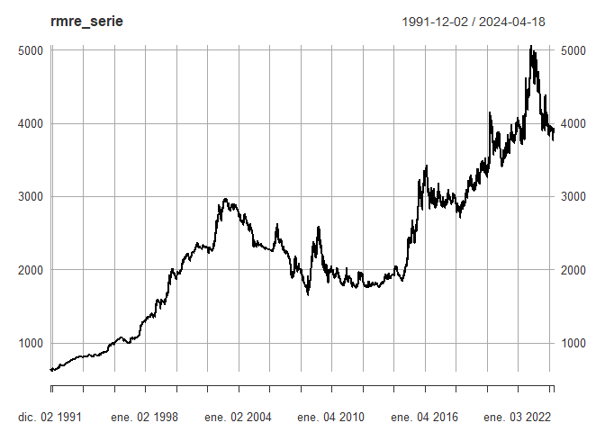

<!-- README.md is generated from README.Rmd. Please edit that file -->

# citmre

<!-- badges: start -->

[](https://lifecycle.r-lib.org/articles/stages.html#experimental)
<!-- badges: end -->

Downloads the Representative Market Rate Exchange (RMRE) from the
\<www.datos.gov.co\> source. Allows setting the data series in time
frequencies, splitting the time series through start and end functions,
transforming the data set in log returns or levels, and making a Dynamic
graph.

## Installation

You can install the development version of citmre from:
[GitHub](https://github.com/DavRodEcon/citmre)

``` r
install.packages("citmre")
devtools::install_github("DavRodEcon/citmre")
```

## Example

``` r
library(citmre)
# Show full series dataset
rmre_serie <- rmre_data()

# Show monthly dataset with Plotly Graph
rmre_splited <- rmre_data(frequency = 12, log_return = F, plot_data = T)

# Show quaterly log_return dataset with Plotly Graph
rmre_splited <- rmre_data(frequency = 4, log_return = T, plot_data = T, type = "mean")

# Show splited log return dataset
rmre_splited <- rmre_data("2000-01-01", "2023-12-31", log_return = TRUE)
#> Warning in doTryCatch(return(expr), name, parentenv, handler): start_date:The
#> information will be obtained from the next business day, as the desired date is
#> a holiday or weekend.
#> Warning in doTryCatch(return(expr), name, parentenv, handler): end_date: The
#> information will be obtained from the next business day, as the desired date is
#> a holiday or weekend.

# plot
plot(rmre_serie)
```



## References

Source: Portal de Datos Abiertos \<www.datos.gov.co\>
